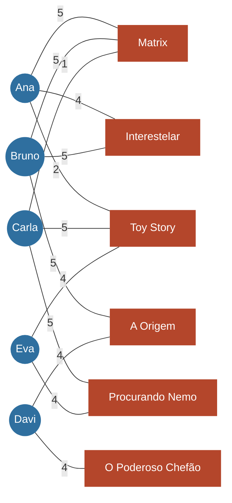
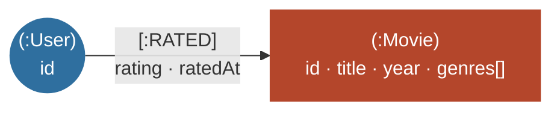

# 01 · Modelo conceitual do grafo

> Marco do TAP: **28/08 — Modelo conceitual de nós e arestas definido.**
> Responsável: Arthur (back-end/algoritmo) · Revisão: Pedro (GP)

## 1. Definição formal

O CineGraph representa o dataset MovieLens como um **grafo bipartido, não direcionado e ponderado**:

$$G = (U \cup M,\ E), \quad U \cap M = \emptyset, \quad E \subseteq U \times M$$

- **U** — conjunto de vértices-usuário
- **M** — conjunto de vértices-filme
- **E** — arestas; cada aresta liga **sempre** um usuário a um filme (nunca usuário–usuário nem filme–filme), o que caracteriza o grafo como bipartido
- **w : E → [0,5 ; 5,0]** — função de peso: a nota que o usuário deu ao filme

## 2. Vértices

| Tipo | Chave no código | Atributos | Origem no MovieLens |
|---|---|---|---|
| Usuário | `u:<id>` | `id` | `ratings.csv → userId` (anonimizado) |
| Filme | `m:<id>` | `id`, `title`, `year`, `genres` | `movies.csv` |

## 3. Arestas

| Elemento | Descrição |
|---|---|
| Extremidades | (usuário *u*, filme *m*) |
| Peso *w(u,m)* | nota de 0,5 a 5,0, em passos de 0,5 |
| Atributo extra | `rated_at` (data/hora da avaliação) |
| Direção | não direcionada: *u* avaliou *m* ⇔ *m* foi avaliado por *u* |
| Multiplicidade | no máximo uma aresta por par (u, m); reavaliar substitui o peso |

> **Ajuste em relação ao TAP:** o TAP cita notas de 1 a 5. O MovieLens `ml-latest-small` usa meia-estrela (0,5 a 5,0), então o peso mantém o valor original para não perder informação.

## 4. Propriedades e métricas usadas

| Conceito de grafos | Significado no domínio |
|---|---|
| **N(u)** — vizinhança de um usuário | filmes que ele avaliou |
| **N(m)** — vizinhança de um filme | usuários que o avaliaram |
| **grau(m)** | popularidade do filme |
| **grau(u)** | quão ativo é o usuário |
| **vizinhança de 2 saltos** de *u* | usuários que avaliaram algum filme em comum com *u* (u → m → v) |
| **vizinhança de 3 saltos** de *u* | filmes avaliados por esses usuários: os **candidatos a recomendação** |
| **caminho mínimo** entre dois usuários | afinidade estrutural (comprimento sempre par: 2, 4, 6…) |

## 5. Exemplo pequeno (grafo de exemplo do projeto)

O mesmo grafo está em `src/server/graph/fixture.ts` e é usado nos testes, no CLI `hello-graph` e no modo demo da interface.



Leituras do exemplo:

- `grau(Matrix) = 3` e `grau(Toy Story) = 3`: são os filmes mais populares.
- A vizinhança de 2 saltos de Ana é {Bruno (Matrix, Interestelar), Carla (Matrix, Toy Story), Eva (Toy Story)}.
- Bruno concorda com Ana nas notas altas e ainda avaliou **A Origem** com 5, então A Origem é a candidata natural para Ana.
- O caminho mínimo Ana → Davi é `Ana → Matrix → Bruno → A Origem → Davi` (comprimento 4).

## 6. Dataset real após o ETL

| | Usuários | Filmes | Arestas |
|---|---:|---:|---:|
| MovieLens `ml-latest-small` original | 610 | 9.742 | 100.836 |
| Após filtros do CineGraph (filme ≥ 5 avaliações, usuário ≥ 20) | **602** | **3.650** | **90.137** |

Grau médio após o filtro: **149,7** filmes por usuário e **24,7** avaliações por filme. O filme de maior grau é *Forrest Gump* (329).

## 7. Persistência no banco de grafos (Neo4j)

Por exigência da disciplina, o grafo é persistido num **banco de dados orientado a grafos**: o **Neo4j AuraDB Free**. O modelo de grafo de propriedades do Neo4j representa o grafo bipartido diretamente, sem tradução para tabelas:



| Conceito do grafo | No Neo4j |
|---|---|
| Vértice-usuário | nó com label `:User`, propriedade `id` |
| Vértice-filme | nó com label `:Movie`: `id`, `title`, `year`, `genres` (lista nativa), `tmdbId`, `imdbId` |
| Metadados de exibição | no mesmo nó `:Movie`, vindos do TMDB: `titlePt`, `overview`, `posterPath`, `backdropPath`, `voteAverage`, `runtime` (não entram no algoritmo) |
| Aresta ponderada | relacionamento `(:User)-[:RATED]->(:Movie)` com `rating` (peso) e `ratedAt` |
| Unicidade / índice | constraints `user_id` e `movie_id` (`V1__grafo_inicial.cypher`) e índice `movie_tmdb_id` (`V2__indice_tmdb.cypher`) |

> **Origem dos dados:** vértices e arestas (quem avaliou o quê, com qual nota) vêm **só do MovieLens**. O TMDB entra apenas como fonte de metadados dos filmes (pôster, sinopse, título em português). A ligação é exata, pelo `links.csv` do MovieLens: os 3.650 filmes do grafo têm `tmdbId`. Os endpoints de recomendação do TMDB (`/recommendations`, `/similar`) **não são usados**.

O relacionamento é gravado com direção (usuário → filme), mas as consultas o percorrem nos dois sentidos, então o grafo segue não direcionado para o algoritmo. O schema evolui por **migrações versionadas** (estilo Flyway), descritas em `db/migrations/README.md`.

A aplicação usa o banco de dois jeitos:

1. **Travessia no próprio banco (Cypher):** padrões como `(u)-[:RATED]->(m)<-[:RATED]-(v)` fazem a vizinhança de 2 saltos direto no Neo4j (`src/server/db/graphQueries.ts`).
2. **Grafo em memória:** o grafo inteiro é carregado uma vez como lista de adjacência (`Map`) e o algoritmo de recomendação roda em TypeScript, de forma explícita e auditável.

As duas versões precisam dar o mesmo resultado e têm o tempo comparado nos testes de carga.

### Por que um banco de grafos e não SQL?

No modelo relacional, "usuários com gosto parecido e o que eles viram" exige self-joins encadeados na tabela de avaliações:

```sql
-- candidatos para o usuário 1: 3 cópias da tabela de arestas
select r3.movie_id, count(*)
from ratings r1
join ratings r2 on r2.movie_id = r1.movie_id and r2.user_id <> r1.user_id  -- salto 2
join ratings r3 on r3.user_id  = r2.user_id                                -- salto 3
where r1.user_id = 1
  and r3.movie_id not in (select movie_id from ratings where user_id = 1)
group by r3.movie_id;
```

O resultado intermediário cresce com Σ grau(m) × grau(v). No Neo4j, a mesma pergunta é o próprio desenho do caminho. Cada salto segue ponteiros de adjacência (*index-free adjacency*), sem junção de tabelas:

```cypher
MATCH (u:User {id: 1})-[:RATED]->(m:Movie)<-[:RATED]-(v:User)-[:RATED]->(rec:Movie)
WHERE v <> u AND NOT (u)-[:RATED]->(rec)
RETURN rec.title, count(DISTINCT v) AS vizinhos
ORDER BY vizinhos DESC LIMIT 10
```

A similaridade ponderada e o score continuam implementados pela equipe (ver [02-algoritmo.md](02-algoritmo.md)). Não são usados os algoritmos prontos da biblioteca Graph Data Science.
