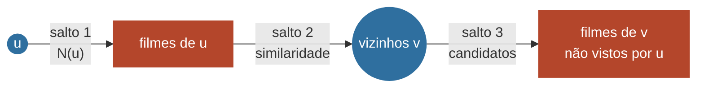

# 02 · Algoritmo de recomendação por vizinhança

> Marco do TAP: **04/09 — Algoritmo de recomendação por vizinhança definido (entrada, saída e complexidade).**
> Responsável: Arthur (back-end/algoritmo) · Implementado em `src/server/graph/recommend.ts` (antecipado do checkpoint 1) · PoC no terminal: `npm run recommend -- --user=1`

O algoritmo é **filtragem colaborativa baseada em usuários, feita como travessia do grafo bipartido**. Não usa nenhuma biblioteca de machine learning. Cada passo é um salto no grafo, e cada recomendação sai acompanhada do caminho que a justifica.

## 1. Entrada

| Parâmetro | Tipo | Padrão | Significado |
|---|---|---|---|
| `userId` | inteiro | — | usuário de origem *u* |
| `k` | inteiro | 10 | quantos filmes recomendar |
| `neighbors` | inteiro | 30 | quantos vizinhos mais similares usar (top-K) |
| `minCommon` | inteiro | 3 | mínimo de filmes em comum para *v* contar como vizinho |
| `minSupport` | inteiro | 2 | mínimo de vizinhos que avaliaram o filme candidato |
| `shrinkage` (λ) | real | 2 | suavização do score em direção à média de *u* (0 desliga) |

Pré-condição: o grafo *G* está carregado em memória como lista de adjacência (`Graph`, em `src/server/graph/Graph.ts`).

## 2. Passos (3 saltos a partir de *u*)



**Salto 1: perfil.** Lê N(u), os filmes avaliados por *u* com suas notas.

**Salto 2: vizinhos (BFS de profundidade 2).** Para cada filme *m* ∈ N(u), percorre N(m) e acumula, para cada usuário *v ≠ u* encontrado:
- os filmes em comum com *u* (`via`)
- o produto escalar parcial `dot(u,v) += w(u,m) · w(v,m)`

Depois calcula a **similaridade cosseno** entre os vetores de notas:

$$\text{sim}(u,v) = \frac{\sum_{m \in N(u)\cap N(v)} w(u,m)\,w(v,m)}{\lVert w_u \rVert \cdot \lVert w_v \rVert}, \qquad \lVert w_u \rVert = \sqrt{\textstyle\sum_{m \in N(u)} w(u,m)^2}$$

As normas usam **todas** as avaliações de cada usuário (e não só as em comum). Assim, um vizinho com 1 filme em comum não recebe similaridade 1 por acaso. Vizinhos com menos de `minCommon` filmes em comum são descartados, e ficam os `neighbors` mais similares (top-K).

**Salto 3: candidatos.** Para cada vizinho *v* do top-K, percorre N(v). Todo filme *m'* ∉ N(u) vira candidato, com a nota média ponderada pela similaridade:

$$\text{score}(u,m') = \frac{\sum_{v \in K,\ m' \in N(v)} \text{sim}(u,v)\cdot w(v,m')}{\sum_{v \in K,\ m' \in N(v)} \text{sim}(u,v)}$$

Candidatos com menos de `minSupport` vizinhos são descartados. Os `k` de maior score são devolvidos, com desempate pelo número de vizinhos que sustentam o filme.

**Suavização (ajuste de 24/09, após testar com os dados reais).** Com a média ponderada pura, um filme obscuro que só 2 vizinhos avaliaram com 5★ fica acima de um clássico que 17 vizinhos avaliaram com média 4,4. Isso acontece porque ter pouca evidência não pesa nada na fórmula. A correção é puxar o score para a média das notas do próprio usuário (μ_u), com força λ:

$$\text{score}_\lambda(u,m') = \frac{\sum \text{sim}(u,v)\cdot w(v,m') \;+\; \lambda\,\mu_u}{\sum \text{sim}(u,v) \;+\; \lambda}$$

Com muitos vizinhos, o somatório domina e o score quase não muda. Com poucos, o score fica perto de μ_u. Com λ = 2, as primeiras recomendações do usuário 1 passaram a ser *Dr. Fantástico*, *O Poderoso Chefão* e *12 Homens e uma Sentença*, em vez de filmes obscuros. λ = 0 reproduz a fórmula original, usada no exemplo resolvido da seção 5.

**Explicação ao usuário final.** A interface traduz os `supporters` em frases como "Para quem amou *Seven* e *Os Suspeitos*". Os filmes-ponte são escolhidos entre os que *u* e os vizinhos amaram (nota ≥ 4), preferindo os do mesmo gênero do filme indicado e os menos populares, para a explicação ser específica.

**Filmes relacionados (página de cada filme).** "Quem amou este filme também amou" é uma travessia de 2 saltos a partir do **filme**: *m* → fãs de *m* (nota ≥ 4) → outros filmes que esses fãs amaram. O resultado é ordenado pela similaridade cosseno entre os conjuntos de fãs, |F(m) ∩ F(m')| / √(|F(m)|·|F(m')|), para os filmes mais populares não aparecerem em todas as listas (`relatedMovies` em `recommend.ts`).

**Fallback (cold start):** se *u* não tiver vizinhos válidos, devolve os filmes de maior **grau** ainda não vistos por *u*, com `strategy: "popularity"`.

## 3. Pseudocódigo

```text
RECOMENDAR(G, u, k, K, minCommon, minSupport):
    dot ← mapa vazio            # v → Σ w(u,m)·w(v,m)
    via ← mapa vazio            # v → filmes em comum
    para cada (m, wu) em N(u):                 # salto 1
        para cada (v, wv) em N(m), v ≠ u:      # salto 2
            dot[v] += wu · wv
            via[v].adicionar(m)

    vizinhos ← []
    para cada v em dot:
        se |via[v]| ≥ minCommon:
            vizinhos.adicionar((v, dot[v] / (‖u‖·‖v‖)))
    vizinhos ← top K por similaridade

    se vizinhos vazio: retornar POPULARES(G, u, k)

    num, den, apoio ← mapas vazios
    para cada (v, sim) em vizinhos:
        para cada (m', wv) em N(v):            # salto 3
            se m' ∉ N(u):
                num[m'] += sim · wv
                den[m'] += sim
                apoio[m'].adicionar(v)

    candidatos ← { m' | |apoio[m']| ≥ minSupport }
    retornar top k de candidatos por num[m']/den[m']
```

## 4. Saída (contrato entre as frentes)

Tipos em `src/server/graph/types.ts` (`RecommendationRequest` / `RecommendationResult`). Esse é o formato que a API devolve e que a interface consome:

```json
{
  "userId": 1,
  "strategy": "neighborhood",
  "recommendations": [
    {
      "movieId": 60,
      "title": "A Origem",
      "score": 5.0,
      "supporters": [
        { "userId": 2, "similarity": 0.775, "via": [10, 20], "rating": 5 }
      ]
    }
  ],
  "stats": { "visitedNodes": 11, "ms": 0.08 }
}
```

`supporters[].via` é o caminho *u → m → v* que liga o usuário ao vizinho, e `rating` é a aresta *v → m'*. Com isso a interface consegue mostrar **por que** cada filme foi recomendado, o que atende ao risco "caixa-preta" do TAP.

## 5. Exemplo resolvido (grafo de exemplo, `minCommon = 1`, `minSupport = 1`)

Normas: ‖Ana‖ = √45 ≈ 6,708 · ‖Bruno‖ = √75 ≈ 8,660 · ‖Carla‖ = √51 ≈ 7,141 · ‖Eva‖ = √32 ≈ 5,657

| Vizinho *v* | Em comum com Ana | dot | sim(Ana, v) |
|---|---|---:|---:|
| Bruno | Matrix (5·5), Interestelar (4·5) | 45 | **0,775** |
| Carla | Matrix (5·1), Toy Story (2·5) | 15 | 0,313 |
| Eva | Toy Story (2·4) | 8 | 0,211 |

Davi fica a 4 saltos de Ana e **não** é vizinho. Por isso *O Poderoso Chefão* não é candidato.

| Candidato | Sustentado por | score |
|---|---|---:|
| A Origem | Bruno (5) | (0,775·5) / 0,775 = **5,00** |
| Procurando Nemo | Carla (5), Eva (4) | (0,313·5 + 0,211·4) / (0,313 + 0,211) ≈ **4,60** |

Ana recebe **A Origem** primeiro, indicada pelo vizinho que mais concorda com ela (Bruno, que também deu nota alta a Matrix e Interestelar).

## 6. Complexidade

Notação: d(x) = grau do vértice *x*; K = vizinhos usados; C = nº de candidatos.

| Etapa | Tempo |
|---|---|
| Salto 1 — ler N(u) | O(d(u)) |
| Salto 2 — acumular dot e via | O(Σ_{m∈N(u)} d(m)) |
| Similaridade + top-K | O(V₂ log K) com heap, V₂ = usuários alcançados |
| Salto 3 — candidatos | O(Σ_{v∈K} d(v)) |
| Ordenação final | O(C log C) |

- **Total por consulta:** O(Σ_{m∈N(u)} d(m) + Σ_{v∈K} d(v) + C log C), limitado por **O(|E| + C log C)**, porque cada salto percorre cada aresta no máximo uma vez.
- **Normas ‖w_v‖:** calculadas uma vez na carga, em O(|E|).
- **Memória:** O(|U| + |M| + |E|) para a lista de adjacência, mais O(V₂ + C) por consulta.

**Medição inicial (hello graph, dataset real, Node 22):** carga do grafo com 602 usuários, 3.650 filmes e 90.137 arestas em ~470 ms. O salto 2 do usuário 1 alcança 596 usuários em **~4 ms**.

> **Observação importante:** o salto 2 alcança praticamente todos os usuários (596 de 601), porque os filmes populares conectam todo mundo. Por isso a **ponderação por similaridade e o corte top-K são indispensáveis**: sem eles, "vizinho" não discriminaria nada. Esse comportamento será medido nos testes de carga do checkpoint 4.

## 6.1 Os saltos no banco de grafos (Cypher)

Os mesmos saltos podem ser executados pelo Neo4j. O salto 2, com o produto escalar já acumulado, fica assim:

```cypher
MATCH (u:User {id: $userId})-[ru:RATED]->(m:Movie)<-[rv:RATED]-(v:User)
WHERE v <> u
WITH v, sum(ru.rating * rv.rating) AS dot, collect(m.id) AS via
WHERE size(via) >= $minCommon
RETURN v.id AS userId, dot, via
```

A travessia (encontrar vizinhos e filmes em comum) pode rodar no banco. A **fórmula de similaridade, o top-K, o score e a explicação continuam no código da equipe**, e **não** se usa a biblioteca Graph Data Science. Nos testes de carga, três estratégias serão medidas:

| Estratégia | Onde roda a travessia | Custo dominante |
|---|---|---|
| Memória | lista de adjacência no servidor Node | O(Σ d(m)) em RAM + carga inicial do grafo |
| Cypher | Neo4j AuraDB | O(Σ d(m)) no banco + ida e volta pela rede |
| Híbrida | salto 2 em Cypher, saltos seguintes em memória | equilíbrio entre as duas |

A versão em memória serve de **referência**: as duas implementações precisam devolver os mesmos vizinhos (o `hello-graph --db` já compara as contagens).

**Primeiras medições com o Neo4j AuraDB Free** (24/09, Node 22, dataset completo):

| Medida | Resultado |
|---|---|
| Salto 2 do usuário 1: memória × Cypher | 596 × 596 usuários, com os **mesmos** vizinhos e filmes em comum |
| Tempo do salto 2 em memória | ~2–7 ms |
| Tempo do salto 2 em Cypher | ~0,5–0,7 s (inclui ida e volta pela rede até o Aura) |
| Carga do grafo do Neo4j para a memória, 1 linha por aresta | 22,7 s (90.137 registros) |
| Carga do grafo, arestas **agrupadas por usuário** | **3,7 s** (602 registros), já com a conexão |

Lição para os testes de carga: com o banco na nuvem, o custo é dominado pelo **número de registros trafegados**. Agrupar a vizinhança de cada vértice (`collect`) reduziu a carga em 6 vezes.

## 7. Métricas de grafo complementares

| Métrica | Implementação | Uso |
|---|---|---|
| Grau do filme | `movieDegree`, `topMoviesByDegree` (`metrics.ts`) | popularidade, fallback de cold start |
| Grau do usuário | `userDegree` | perfil/atividade |
| Vizinhança de 2 saltos | `twoHopNeighbors` (`traversal.ts`) | base do salto 2 |
| Caminho mínimo (BFS) | `shortestPath` (`traversal.ts`) | afinidade entre dois usuários na interface |
| BFS limitada | `bfs(graph, start, maxDepth)` | subgrafo para a visualização (checkpoint 5) |

## 8. Casos de borda

| Situação | Comportamento |
|---|---|
| `userId` inexistente | API responde 404 |
| Usuário sem vizinhos com `minCommon` | fallback por popularidade (`strategy: "popularity"`) |
| Menos de `k` candidatos | devolve os que houver |
| Empate de score | desempata por nº de `supporters` e depois por grau do filme |
