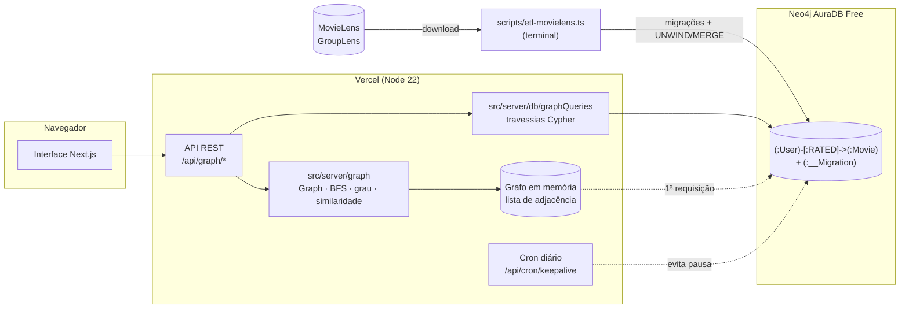

# 03 · Stack tecnológica e ambiente

> Marco do TAP: **11/09 — Stack tecnológica definida e ambiente funcional ("hello graph").**
> Decisão: Pedro (GP) · Validação: equipe · Revisão 25/09: persistência trocada para banco de grafos (exigência do professor)

## 1. Critérios de escolha

1. **Banco de dados orientado a grafos:** exigência explícita da disciplina.
2. **Apresentar em sala só com navegador:** a demo roda numa URL pública, sem instalar nada nos PCs da faculdade.
3. **Rodar local sem dor, se o professor pedir:** uma única versão de runtime (Node.js 22 LTS), que pode ser usada como zip portátil, sem permissão de administrador.
4. **Custo zero** (restrição do TAP): só planos gratuitos.
5. **Algoritmo explícito:** BFS, grau e similaridade escritos pela equipe, sem bibliotecas de ML nem algoritmos prontos de grafos.
6. **Uma linguagem só** para as três frentes, o que reduz o risco de desalinhamento apontado no TAP.

## 2. Stack escolhida

| Camada | Tecnologia | Por quê |
|---|---|---|
| Runtime | **Node.js 22 LTS** (`.nvmrc`, `engines: 22.x`) | LTS com suporte até 2027; roda igual em Windows, Linux e Vercel; tem versão portátil |
| Linguagem | **TypeScript** | tipagem ajuda a manter o contrato entre as frentes (`types.ts`) |
| Aplicação web + API | **Next.js 15** (App Router) | front e API REST no mesmo projeto, um único deploy |
| Estilo | Tailwind CSS 4 | rápido de iterar; sem fontes externas (fontes do sistema) |
| **Banco de dados** | **Neo4j AuraDB Free** | banco de grafos de referência (Cypher), gerenciado e grátis; o grafo bipartido vira `(:User)-[:RATED]->(:Movie)` |
| Metadados de filmes | **API do TMDB** (só `/movie/{id}`, no ETL) | pôster, sinopse e título em pt-BR gravados no nó `:Movie`; na apresentação só as imagens vêm do CDN do TMDB; token fica só no terminal |
| Driver | `neo4j-driver` (oficial) | funciona em Node 22 e na Vercel; inteiros convertidos para `number` |
| Migrações | runner próprio **estilo Flyway** (`scripts/migrate.ts`) | arquivos `V<n>__desc.cypher` versionados, checksum e histórico em `(:__Migration)`; roda sozinho no deploy de produção |
| Algoritmo do grafo | **TS puro** (`Map`/`Set`) em `src/server/graph` + travessias Cypher em `src/server/db/graphQueries.ts` | exigência metodológica do TAP; as duas versões são comparadas |
| Scripts de terminal | `tsx` | roda `.ts` direto: ETL, migrações, hello-graph e PoC do checkpoint 1 |
| Testes | Vitest | testes unitários do grafo e das migrações |
| Hospedagem | **Vercel** (Hobby, grátis) | deploy automático a cada `git push`, HTTPS, URL pública e cron diário |
| Visualização (checkpoint 5) | Cytoscape.js ou react-force-graph (+ Neo4j Browser na demo) | a decidir em 30/10; só desenha, sem lógica de recomendação |

## 3. Arquitetura

- **Duas formas de consultar o grafo:**
  - **Cypher:** a travessia roda no próprio Neo4j (`?engine=cypher`).
  - **Memória:** o grafo é carregado uma vez por instância (~0,5 s) e o algoritmo roda em TypeScript.

  A comparação entre as duas entra no relatório de testes de carga.
- **Migrações automáticas:** no deploy de produção, o script `vercel-build` roda `migrate --deploy` antes do `next build`. O ETL também aplica as pendentes antes de carregar.
- **Resiliência na apresentação:**
  - Um **cron diário** faz uma escrita mínima (`/api/cron/keepalive`), porque o AuraDB Free pausa após 3 dias sem uso.
  - Se o banco estiver fora do ar, a interface cai para o **modo demo** com o grafo de exemplo e mostra um aviso.
  - O `/api/health` testa a conexão, para conferir antes de entrar em sala.

## 4. Ambiente funcional: "hello graph"

| Verificação | Comando | Resultado |
|---|---|---|
| Testes | `npm test` | 20 testes passando (grafo + migrações) |
| Hello graph offline | `npm run graph:hello` | grafo de exemplo: 11 vértices, 13 arestas, caminho Ana → … → Davi |
| Hello graph com dados reais | `npm run graph:hello -- --csv` | 4.252 vértices, 90.137 arestas, carga ~470 ms, 2 saltos ~4 ms |
| Hello graph via Neo4j | `npm run graph:hello -- --db` | mesmo grafo lido do Neo4j + comparação memória × Cypher |
| Migrações | `npm run db:info` | situação de cada versão |
| Interface | `npm run dev` → http://localhost:3000 | estatísticas, top filmes por grau, vizinhança de 2 saltos (memória e Cypher) |
| API | `/api/health`, `/api/graph/stats`, `/api/graph/neighbors?userId=1[&engine=cypher]` | JSON |

## 5. Alternativas avaliadas e descartadas

| Alternativa | Motivo do descarte |
|---|---|
| Java (Spring) | depende do JDK instalado e na versão certa nos PCs da faculdade; deploy grátis mais difícil |
| PostgreSQL/Supabase | relacional; não atende à exigência de banco orientado a grafos (era a escolha inicial) |
| Memgraph Cloud, ArangoDB (ArangoGraph) | só têm trial de 14 dias, sem plano grátis permanente |
| Amazon Neptune | pago |
| Apache AGE (grafo sobre Postgres) | exige servidor próprio; não é oferecido por provedores gratuitos |
| FalkorDB / SurrealDB Cloud | têm plano grátis, mas pouco material e menor adoção; mais difícil de defender |
| Neo4j Graph Data Science (GDS) | algoritmos de similaridade prontos contrariam o objetivo de aprendizado; nem vem no plano Free |
| Liquibase / neo4j-migrations | ferramentas de migração em Java; o runner próprio evita depender do JDK |
| Python + Streamlit | pouco controle da interface e da visualização |

## 6. Limites do AuraDB Free

| Limite | Valor publicado | Uso do CineGraph |
|---|---|---|
| Nós | 50 mil a 200 mil, conforme a página da Neo4j | 4.252 (+ nós de controle) |
| Relacionamentos | 175 mil a 400 mil | 90.137 |
| Inatividade | pausa após 3 dias sem uso | cron diário de keep-alive |

## 7. Como rodar num PC da faculdade (plano B)

1. Baixar o **Node.js 22 LTS, versão .zip (Windows Binary)** em nodejs.org e extrair em qualquer pasta (não precisa de admin).
2. No terminal, dentro da pasta extraída: `set PATH=%CD%;%PATH%`
3. Na pasta do projeto: `npm ci` e depois `npm run dev`
4. Sem `.env.local` a aplicação abre em modo demo. Com ele, usa o Neo4j AuraDB.
