# 04 · EAP — Estrutura Analítica do Projeto

> Marco do TAP: **18/09 — EAP entregue e dataset MovieLens carregado.**
> Responsável: Pedro (GP)

A EAP divide o CineGraph em seis pacotes, alinhados às três frentes fixas do TAP:

| Frente | Integrante |
|---|---|
| Back-end e algoritmo do grafo | **Arthur** Savio Gonçalves Soares |
| Front-end, interface e gerência | **Pedro** Henrique Villas Boas Portella (GP) |
| Dados, persistência e testes de carga | **Rogeres** Gabriel Paiva Matos |

## 1. Árvore

```mermaid
flowchart TD
  P["CineGraph"]
  P --> A["1 Gerenciamento"]
  P --> B["2 Modelagem e algoritmo"]
  P --> C["3 Dados e persistência"]
  P --> D["4 Interface e API"]
  P --> E["5 Testes de carga"]
  P --> F["6 Documentação e apresentação"]

  A --> A1["1.1 TAP"]
  A --> A2["1.2 EAP e cronograma"]
  A --> A3["1.3 Escopo do MVP"]
  A --> A4["1.4 Checkpoints de sincronização"]

  B --> B1["2.1 Modelo conceitual"]
  B --> B2["2.2 Especificação do algoritmo"]
  B --> B3["2.3 Núcleo do grafo"]
  B --> B4["2.4 Recomendação + PoC terminal"]
  B --> B5["2.5 Testes unitários"]

  C --> C1["3.1 Modelo Neo4j + migrações"]
  C --> C2["3.2 ETL MovieLens"]
  C --> C3["3.3 Carga no Neo4j AuraDB"]
  C --> C4["3.4 Camada de acesso"]
  C --> C5["3.5 Travessias Cypher"]
  C --> C6["3.6 Metadados TMDB"]

  D --> D1["4.1 Hello graph"]
  D --> D2["4.2 API de recomendação"]
  D --> D3["4.3 Telas de consulta"]
  D --> D4["4.4 Visualização do grafo"]
  D --> D5["4.5 Deploy Vercel"]

  E --> E1["5.1 Subgrafos de teste"]
  E --> E2["5.2 Medição e relatório"]
  E --> E3["5.3 Otimizações"]

  F --> F1["6.1 README"]
  F --> F2["6.2 Slides e roteiro de demo"]
  F --> F3["6.3 Seminários"]
```

## 2. Dicionário da EAP

Legenda de status em 25/09: ✅ entregue · 🔄 em andamento · ⏳ planejado

| Código | Pacote de trabalho | Entregável | Responsável | Prazo | Status |
|---|---|---|---|---|---|
| **1** | **Gerenciamento** | | **Pedro** | | |
| 1.1 | TAP | Termo de Abertura v1.2 | Arthur | 15/09 | ✅ |
| 1.2 | EAP e cronograma | este documento | Pedro | 18/09 | ✅ |
| 1.3 | Escopo do MVP | `05-escopo-mvp.md` congelado | Pedro | 25/09 | ✅ |
| 1.4 | Checkpoints de sincronização | revisão das 3 frentes a cada checkpoint | Pedro | quinzenal | 🔄 |
| **2** | **Modelagem e algoritmo** | | **Arthur** | | |
| 2.1 | Modelo conceitual | `01-modelo-conceitual.md` | Arthur | 28/08 | ✅ |
| 2.2 | Especificação do algoritmo | `02-algoritmo.md` (entrada, saída, complexidade) | Arthur | 04/09 | ✅ |
| 2.3 | Núcleo do grafo | `Graph`, BFS, grau, 2 saltos, caminho mínimo | Arthur | 11/09 | ✅ |
| 2.4 | Recomendação + PoC terminal | `recommend()` (com suavização λ) + `npm run recommend`: antecipado | Arthur | 02/10 | ✅ |
| 2.5 | Testes unitários do algoritmo | exemplo resolvido do doc 02 + suavização + filmes relacionados (`tests/recommend.test.ts`) | Arthur | 02/10 | ✅ |
| **3** | **Dados e persistência** | | **Rogeres** | | |
| 3.1 | Modelo Neo4j + migrações | `db/migrations/V1__grafo_inicial.cypher` + runner estilo Flyway (`npm run db:migrate`) | Rogeres | 25/09 | ✅ |
| 3.2 | ETL MovieLens | `scripts/etl-movielens.ts` (filtros, `UNWIND`/`MERGE` em lotes, idempotente) | Rogeres | 18/09 | ✅ |
| 3.3 | Carga no Neo4j AuraDB | 602 `:User` · 3.650 `:Movie` · 90.137 `:RATED` no banco (carregado em 24/09) | Rogeres | 25/09 | ✅ |
| 3.4 | Camada de acesso | `loadGraph` com cache e fallback para modo demo; carga otimizada de 22,7 s para 3,7 s | Rogeres | 09/10 | ✅ |
| 3.5 | Travessias Cypher | `graphQueries.ts` (2 saltos, caminho mínimo) comparadas com a versão em memória: mesmos resultados | Arthur + Rogeres | 09/10 | ✅ |
| 3.6 | Metadados TMDB | pôster, sinopse e título pt-BR no nó `:Movie` via ETL (`scripts/tmdb.ts`), com cache e atribuição | Rogeres + Pedro | 25/09 | ✅ |
| **4** | **Interface e API** | | **Pedro** | | |
| 4.1 | Hello graph | página inicial + `/api/graph/stats` e `/neighbors` | Pedro | 11/09 | ✅ |
| 4.2 | API de recomendação | `GET /api/recommendations?userId=` no contrato do doc 02 | Pedro + Arthur | 09/10 | ✅ |
| 4.3 | Telas de consulta | início (perfis), perfil (recomendações + motivo), filme (sinopse, "por que indicamos", relacionados) e "Como funciona" | Pedro | 16/10 | ✅ |
| 4.4 | Visualização do grafo | subgrafo u → vizinhos → recomendações (nós e arestas) | Pedro | 30/10 | ⏳ |
| 4.5 | Deploy Vercel | URL pública, deploy a cada push, migrações automáticas e cron de keep-alive do Aura | Pedro | 02/10 | 🔄 |
| **5** | **Testes de carga** | | **Rogeres** | | |
| 5.1 | Subgrafos de teste | cargas com `--max-users=100/300/602` | Rogeres | 23/10 | ⏳ |
| 5.2 | Medição e relatório | tempo de carga e de consulta por tamanho, memória × Cypher | Rogeres | 23/10 | ⏳ |
| 5.3 | Otimizações | ajustes de estrutura/índices a partir do relatório | Arthur | 30/10 | ⏳ |
| **6** | **Documentação e apresentação** | | **Todos** | | |
| 6.1 | README | como rodar, ETL, deploy, arquitetura | Pedro | 30/10 | 🔄 |
| 6.2 | Slides e roteiro de demo | roteiro com usuário-exemplo e explicação do caminho | Todos | 03/11 | ⏳ |
| 6.3 | Seminários | live demo | Todos | 03/11 · 13/11 · 20/11 | ⏳ |

## 3. Marcos e dependências

```mermaid
flowchart LR
  M1["28/08<br/>Modelo"] --> M2["04/09<br/>Algoritmo"] --> M3["11/09<br/>Stack + hello graph"]
  M3 --> M4["18/09<br/>EAP + dataset"] --> M5["25/09<br/>P1 + MVP congelado"]
  M5 --> C1["02/10<br/>CP1: PoC terminal"] --> C2["09/10<br/>CP2: API"]
  C2 --> C3["16/10<br/>CP3: ponta a ponta"] --> C4["23/10<br/>CP4: testes de carga"]
  C4 --> C5["30/10<br/>CP5: visualização"] --> S["03–20/11<br/>Seminários"]
```

Dependências críticas entre frentes:

- **2.4 → 4.2:** a API só expõe o algoritmo depois da PoC. Mitigação: o contrato de saída já está fixo em `types.ts`, então a interface pode ser feita com dados simulados antes.
- **3.3 → 5.1:** os testes de carga dependem da carga no banco. O ETL com `--max-users` já está pronto.
- **5.2 → 5.3:** as otimizações só entram se o relatório apontar gargalo.
